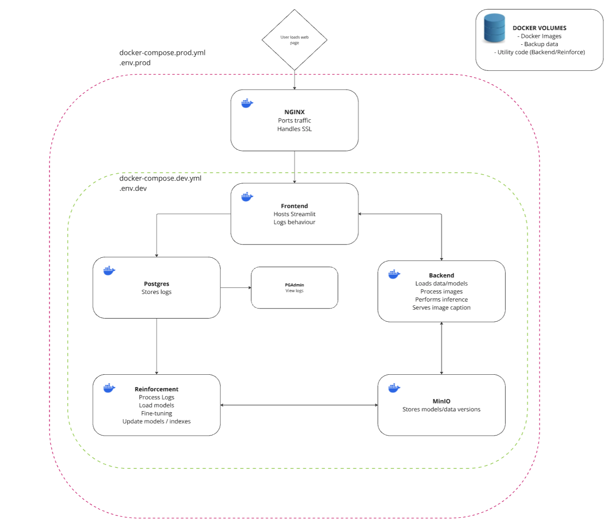

# DeployImageCaptioning

### Container Architecture:




## Local development
- Create .env.prod file (see discord for details) in project root
- Build docker images
```bash
docker-compose --env-file .env.prod -f docker-compose.prod.yml build
```
- run containers
```bash
docker-compose --env-file .env.prod -f docker-compose.prod.yml up -d
```
- If that works, merge to main and we'll deploy to prod

- To stop containers
```bash
docker-compose --env-file .env.prod -f docker-compose.prod.yml down
```

## Deployment Prerequisites

- **Remote Server**: Ensure you have a remote server set up.
- **Project Folder**: Create a project folder on your remote server.
- **Docker Installed**: Install Docker on your remote server.
- **Domain Name**: Associate your domain name with your remote server's IP address.
- **SSL Certificate**: Obtain an SSL certificate for your domain.

## Deployment Steps

1. **Update Domain References**:
   - Search and replace all instances of `inventiveimagecaption.com` in your repository with your actual domain name.

2. **Transfer Files to Remote**:
   - Use `scp` to copy `docker-compose.prod.yml` and `.env.prod` to your project folder on the remote server:
     ```bash
     scp docker-compose.prod.yml .env.prod user@your-remote-ip:/path/to/project-folder/
     ```

3. **Pull Docker Images**:
   - SSH into your remote server and navigate to your project folder. Then, pull the Docker images from Docker Hub:
     ```bash
     docker-compose -f docker-compose.prod.yml pull
     ```

4. **Run Containers**:
   - Start the containers using the `.env.prod` file and the `--no-build` flag:
     ```bash
     docker-compose --env-file .env.prod -f docker-compose.prod.yml up --no-build
     ```

