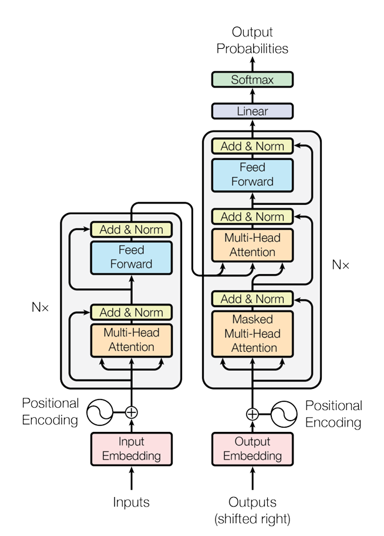
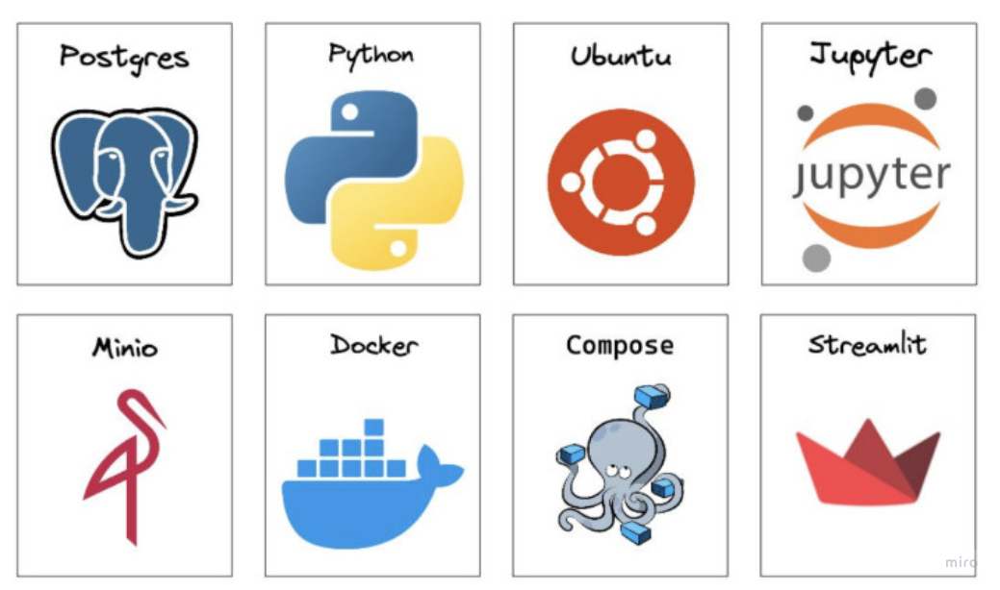

# DeployImageCaptioning

[simplesearchengine.com 🌐](https://www.simplesearchengine.com/)

## Overview

DeployImageCaptioning is the deployment of [ImageCaptioning](https://github.com/kalebsofer/ImageCaptioning), a multi-modal transformer for image captioning. The service provides a simple interface to upload an image and receive and a generated caption, the model uses a similar architecture as described in [Attention is All You Need](https://arxiv.org/abs/1706.03762) .


<div align="center">
  
  <p><em>Transformer Architecture</em></p>
</div>

## Container Architecture

The project is modular and fully containerized, containers have a single purpose and are designed to be stateless. The project is deployed on a small server I rent from Hetzner.

- **Frontend**: Hosted using a Streamlit server.
- **Backend**: Retrieves the model and performs inference on incoming audio transcription requests.
- **Storage**: MinIO is used to store different versions of the transcription model.
- **RDBS**: PostgreSQL is utilized to log user behavior.
- **Traffic**: Traefik is configured to handle traffic and SSL termination.
- **Reinforcement**: Spins up on a schedule, uses PostgreSQL logs for reinforcement, updates the model weights, and pushes the latest version to MinIO.


## Stack



## Local Development

- Update `.env.prod` in project root
- Build images:
  ```bash
  docker-compose --env-file .env.prod -f docker-compose.prod.yml build
  ```
- Run containers:
  ```bash
  docker-compose --env-file .env.prod -f docker-compose.prod.yml up -d
  ```
- Merge to main for prod deploy
- To stop containers:
  ```bash
  docker-compose --env-file .env.prod -f docker-compose.prod.yml down
  ```

## Deployment Prerequisites

- [ ] **Remote Server**: Ensure you have a remote server set up.
- [ ] **Project Folder**: Create a project folder on your remote server.
- [ ] **Docker Installed**: Install Docker on your remote server.
- [ ] **Domain Name**: Associate your domain name with your remote server's IP address.
- [ ] **SSL Certificate**: Obtain an SSL certificate for your domain.

## Deployment Steps

1. **Update Domain References**:
   - Search and replace all instances of `inventiveimagecaption.com` in your repository with your actual domain name.

2. **Transfer Files to Remote**:
   - Use `scp` to copy `docker-compose.prod.yml` and `.env.prod` to your project folder on the remote server:
     ```bash
     scp docker-compose.prod.yml .env.prod user@your-remote-ip:/path/to/project-folder/
     ```

3. **Pull Docker Images**:
   - SSH into your remote server and navigate to your project folder. Then, pull the Docker images from Docker Hub:
     ```bash
     docker-compose -f docker-compose.prod.yml pull
     ```

4. **Run Containers**:
   - Start the containers using the `.env.prod` file and the `--no-build` flag:
     ```bash
     docker-compose --env-file .env.prod -f docker-compose.prod.yml up --no-build
     ```

